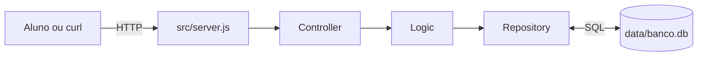

# API de desenvolvimento

API em Express para os alunos praticarem desenvolvimento por User Stories.
O projeto usa SQLite e mantém o fluxo em camadas:

```text
server -> controller -> logic -> repository -> data/banco.db
```

## Fluxo visual



O controller traduz HTTP, a logic coordena o caso de uso e o repository
executa os comandos SQL. Cada camada tem uma responsabilidade clara.

## Pré-requisito

O projeto usa o módulo `node:sqlite`, disponível no Node.js **22.13 ou
superior**.

```bash
node --version
npm install
```

Ao iniciar, o Node pode mostrar um aviso `ExperimentalWarning` sobre SQLite.
Esse aviso é esperado e não impede a execução.

## Como executar

```bash
npm start
```

Durante o desenvolvimento:

```bash
npm run dev
```

Verifique o lint com:

```bash
npm run lint
```

A API ficará disponível em `http://localhost:3000`.

## Banco de dados

O arquivo `data/banco.sql` cria as tabelas e os dados iniciais. A conexão
(`src/database/conexao.js`) executa esse script sempre que a API inicia.

- `CREATE TABLE IF NOT EXISTS` não recria tabelas existentes.
- `INSERT OR IGNORE` não duplica os dados iniciais.
- `data/banco.db` é criado automaticamente e não deve ser versionado.

Para voltar aos dados iniciais, pare a API, remova `data/banco.db` e inicie
novamente.

## Endpoints de exemplo

### `GET /`

Retorna a primeira tarefa do banco:

```bash
curl http://localhost:3000/
```

### `GET /tarefas`

Lista as tarefas:

```bash
curl http://localhost:3000/tarefas
```

## Exemplo direto do repository

O comando abaixo mostra `listar`, `criar`, `buscarPorId`, `atualizar` e
`remover` sem precisar iniciar o servidor:

```bash
npm run exemplo
```

## Organização do código

- `src/server.js`: configura o Express e registra as rotas.
- `src/controllers/tarefaController.js`: traduz requisições e respostas HTTP.
- `src/logic/tarefaLogic.js`: coordena o caso de uso.
- `src/models/tarefa.js`: modelo disponível para as próximas atividades.
- `src/database/conexao.js`: abre o banco e executa `data/banco.sql`.
- `src/repositories/tarefaRepository.js`: executa o SQL do CRUD de tarefas.
- `src/exemplo-repository.js`: demonstra o repository no terminal.
- `data/banco.sql`: define tabelas e dados iniciais.

## Sugestões de atividades

- Criar `GET /tarefas/:id` para buscar uma tarefa.
- Criar `POST /tarefas` para cadastrar uma tarefa.
- Criar `PATCH /tarefas/:id` para atualizar uma tarefa.
- Criar `DELETE /tarefas/:id` para remover uma tarefa.
- Criar um `usuarioRepository` para a tabela `usuarios`.
- Adicionar testes automatizados para controller, logic e repository.
- Criar filtros por conclusão, prioridade ou usuário.
