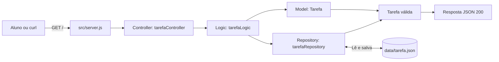

# API de desenvolvimento

API mínima em Express para os alunos praticarem desenvolvimento por issues.
O projeto começa retornando uma tarefa e separa o código em três camadas:

```text
controller -> logic -> model -> repository -> data/tarefa.json
```

## Fluxo visual



Em resumo: o aluno faz uma requisição, o `server.js` encaminha para o
controller, a logic coordena o caso de uso e o repository acessa o arquivo.
Quando uma tarefa é cadastrada, a model valida os dados antes da persistência.

## Como executar

Pré-requisito: Node.js instalado.

Na pasta do projeto, instale as dependências:

```bash
npm install
```

Inicie a API:

```bash
npm start
```

Durante o desenvolvimento, use o Nodemon:

```bash
npm run dev
```

Para verificar a qualidade do código sem executar testes unitários:

```bash
npm run lint
```

A API ficará disponível em `http://localhost:3000`.

## Endpoint inicial

### `GET /`

Retorna a tarefa persistida no arquivo `data/tarefa.json`:

```json
{
  "id": 1,
  "titulo": "Aprender Express",
  "descricao": "Implementar a primeira tarefa da API",
  "prioridade": "media",
  "concluida": false
}
```

Teste com:

```bash
curl http://localhost:3000/
```

### `GET /tarefas`

Lista todas as tarefas salvas em `data/tarefa.json`.

```bash
curl http://localhost:3000/tarefas
```

### `POST /tarefas`

Cadastra uma tarefa. O campo `titulo` é obrigatório; `descricao` é opcional e
`prioridade` usa `media` como padrão.

```bash
curl -X POST http://localhost:3000/tarefas \
  -H "Content-Type: application/json" \
  -d '{"titulo":"Estudar camadas","prioridade":"alta"}'
```

A resposta de sucesso possui status `201`. Se o título estiver ausente ou
vazio, a model lança `ErroDeValidacao` e a API responde com status `400`.

## Organização do código

- `src/server.js`: configura o Express e registra a rota.
- `src/controllers/tarefaController.js`: recebe a requisição e monta a resposta HTTP.
- `src/logic/tarefaLogic.js`: representa a regra de negócio do caso de uso.
- `src/models/tarefa.js`: classe `Tarefa` e `ErroDeValidacao`, responsáveis pela validação da entidade.
- `src/repositories/tarefaRepository.js`: lê e grava diretamente o arquivo JSON.
- `data/tarefa.json`: armazenamento inicial da tarefa.

O repository recria o arquivo com a tarefa padrão se ele ainda não existir.

## Sugestões de issues para os alunos

- ~~Criar uma rota `GET /tarefas` para listar tarefas.~~ (exemplo pronto)
- ~~Permitir cadastrar uma tarefa usando `POST`.~~ (exemplo pronto)
- Criar `GET /tarefas/:id` para buscar uma tarefa.
- Permitir alterar uma tarefa usando `PUT` ou `PATCH`.
- Permitir remover uma tarefa usando `DELETE`.
- Validar o formato do corpo das requisições.
- Criar tratamento centralizado de erros. 
- Adicionar testes automatizados para controller, logic e repository.
- Substituir o arquivo JSON por outro mecanismo de persistência.
- Documentar a API com exemplos de requisições e respostas. 
